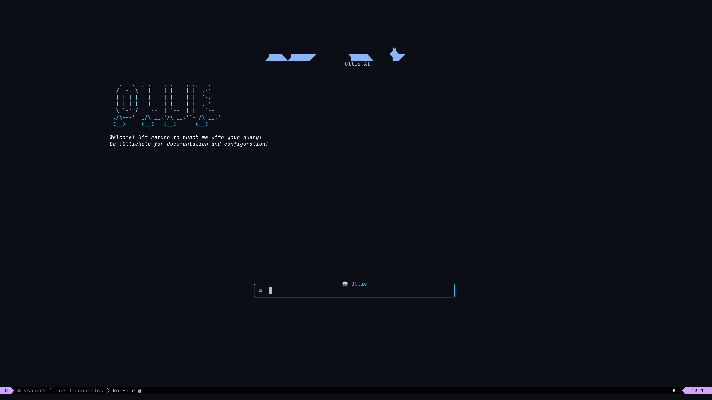
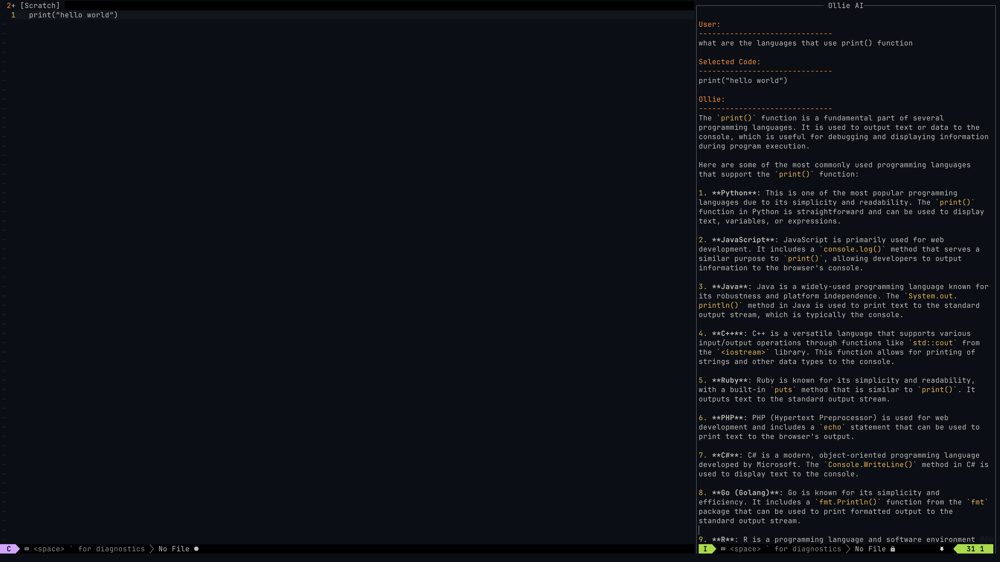
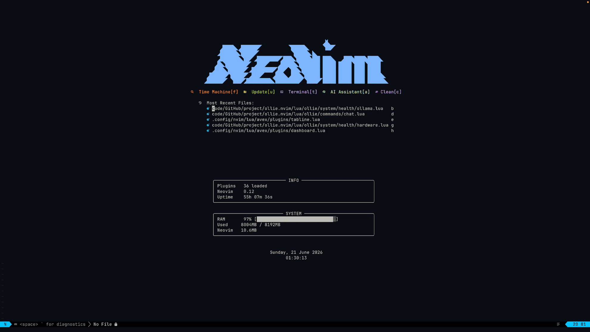

# Ollie

Ollie.nvim is an open-source, AI self-host backend Neovim plugin that integrates large language models into the editor through a modular routing and provider system.

It supports both local inference engines and remote APIs, enabling privacy-first and extensible AI workflows.

The architecture separates UI, request handling, and model providers, allowing developers to extend or replace backend engines without modifying core logic.
</br>

### Media

<div align = "center">




</div>

### Features

- **Structured handlers** — Discrete commands for explanation, debugging, fixing, and many more coming soon. Each handler owns its context and prompt logic independently.
- **Streaming responses** — Streaming incremental responses. No waiting for full completions.
- **Async job architecture** — All I/O runs off the main thread via Neovim's `vim.loop` / `vim.jobstart`. The editor never blocks.
- **Buffer context management** — Smart context assembly from the active buffer, visual selection, LSP diagnostics, and file metadata.
- **Health system** — Built-in `:checkhealth ollie` covering hardware capability, internet reachability, model availability, and Ollama process status.
- **Security layer** — Permission model, policy enforcement, and trust management for sensitive operations.
- **Selector abstraction** — Picker-agnostic model and provider selection. Works with `telescope.nvim`, `fzf-lua`, `vim.ui.select`, or custom frontends.
- **Multi-provider support** — You can add providers such as Anthropic (Claude API), OpenAI (Cloud API), Google (Cloud), Ollama (local inference). Switch providers per task. For building multi-provider support, check [#Providers](docs/documentation.md) on doucmentation.md

</br>

<h3 align="left">
  Sending the query
</h3>

<p align="center">
  
</p>

</br>
 
### Personal Assistant Architecture
```text
┌─────────────────────────────────────────────┐
│                 UI Layer                    │                       
├─────────────────────────────────────────────┤
│              Command Layer                  │
├─────────────────────────────────────────────┤
│              Handler Layer                  │ 
├─────────────────────────────────────────────┤
|               Core router                   |
├─────────────────────────────────────────────┤
│             Provider Layer                  │
├─────────────────────────────────────────────┤
|              Stream Engine                  |
├─────────────────────────────────────────────┤
│              Core System                    |
│  ┌──────────────────┬──┬──────────────────┐ │
│  │ Context Manager  |  │ Session Manager  │ │
│  │ - buffer context |  │  - chat history  │ │
│  │ - selection      |  │  - persistence   │ │ 
│  └──────────────────┴──┴──────────────────┘ │
├─────────────────────────────────────────────┤
│               Async Job Layer               │
└─────────────────────────────────────────────┘
```

</br>

Default model is `avexcoder_3b:latest` from ollama. It is designed around a clean separation of concerns: providers handle model communication, security, permissions, handlers define task semantics, and the UI layer stays thin and replaceable. The goal is a plugin you can trust, extend, and run entirely on low-end till high-end devices. Its router dispatches requests asynchronously across providers and experimental hardware-aware routing — so you run the best model your environment can actually support.

NOTE: Run `pkill ollama` after exiting neovim.

</br>

```
ollie.nvim
├── providers/        # API clients for each LLM backend (cloud, local)
├── handler/          # Task logic: explain, and fix
├── core/             # Execution backend
├── parser/           # Response formatter
├── ui/               # Panel and floating window rendering
├── system/           # Boundaries and hardware-layer health verification
├── commands/         # User-facing command definitions
```

Design principles:

- Providers are stateless adapters. They translate requests to API shapes and return a stream or a string. They know nothing about Neovim buffers.
- Handlers are stateless functions. They assemble context, call a provider via the router, and write output. They know nothing about which provider is active.
- The router is the only component that knows both sides. Swapping a provider never touches handler code.
- The UI layer is purely presentational. It receives text and renders it. No business logic lives there.
- The health system is a first-class citizen, not an afterthought. If something is misconfigured, `:checkhealth` should tell you exactly what and why.

<br>

### Installation

Requirements:

1. Neovim >= 0.10
2. curl (for HTTP providers)

<u><b>lazy.nvim</b></u>
<br>

```lua
lua{
  "avexcz/ollie.nvim",
  dependencies = {
    "nvim-lua/plenary.nvim",
    -- optional, for selector layer
    "nvim-telescope/telescope.nvim",
  },
  opts = {},
}
```

<b><u>packer.nvim</u></b>
<br>

```lua
luause {
  "avexcz/ollie.nvim",
  requires = { "nvim-lua/plenary.nvim" },
  config = function()
    require("nvim-ai").setup({})
  end
}
```

<br>

### Configuration

```lua
require("ollie").setup({

    default_provider = "ollama",
    default_model = "qwen2.5-coder:3b",
    streaming = true,
})
```

<br>

| Command              | Description                                                                          |
| -------------------- | ------------------------------------------------------------------------------------ |
| `Ollie`              | Open the dashboard                                                                   |
| `:OllieChat`         | Open the chat interface with the active provider and model                           |
| `:OllieChatContext`  | Send the whole buffer and open the chat interface with the active provider and model |
| `:OllieFix`          | Diagnose and apply a fix for the current error via selection                         |
| `OllieExplain`       | Discuss the matter and provide details based on user query via selection             |
| `:OllieModel`        | Switch the active model via selector                                                 |
| `:OllieProvider`     | Switch the active provider via selector                                              |
| `:OllieSessions`     | Browse and resume previous sessions                                                  |
| `OllieSessionDelete` | Delete single conversation history                                                   |
| `OllieSessionClear`  | Clear entire conversation history                                                    |
| `:OllieHealth`       | Validate providers, credentials, hardware health, recommanded model and dependencies |

<br>

### Contributing

Contributions are welcome. Before opening a PR, please read the following.

---

**Project conventions:**

- Lua files follow the existing module structure. New functionality belongs in an appropriate layer — provider logic in `providers/`, user-facing operations in `handler/`, rendering in `ui/`.
- No business logic in the UI layer. No Neovim API calls in providers.
- All async operations use `vim.loop` or `vim.system`. No blocking I/O on the main thread.
- New providers must implement the provider interface defined in `providers/init.lua`.
- New handlers must be reachable via the router and must not hardcode a provider.

</br> For contributing, please see [Contribution](docs/CONTRIBUTING.md) for contributing guidance.

</br>

## Guidance

See [documentation](/docs/documentation.md) for more info. </br>
See [configuration](/docs/configuration.md) for configuration. </br>
See [List of commands](/docs/command.md) for understanding how to use commands. </br>

<sub>Built for Neovim. Runs anywhere, is a Lua runtime and an HTTP connection (or local model), that can reach.</sub>
